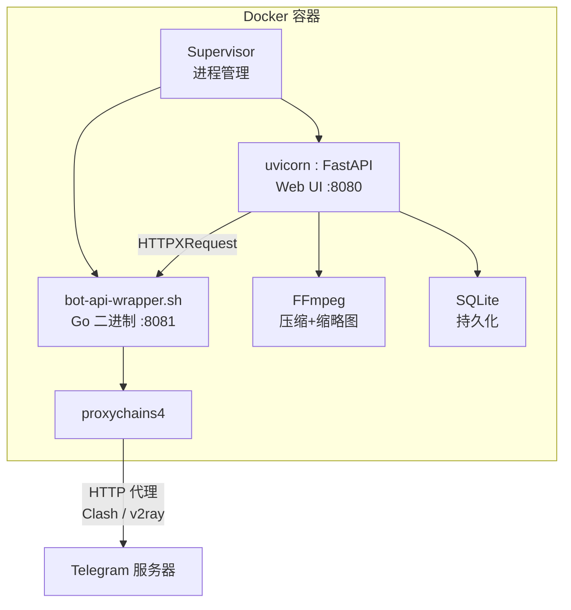

# 🎬 TG视频发布助手

> Telegram 视频自动化发布工具 — 压缩、宫格缩略图、定时发布、统一工作台。

[](LICENSE)
[](https://python.org)
[](https://vuejs.org)

---

## ✨ 特性

| 模块 | 说明 |
|------|------|
| 🎥 **视频工作台** | 单行工具栏、多视频源切换、面包屑导航、多选视频 → 一键跳转压缩/发布/计划，支持清理失效记录 |
| 📂 **多视频源** | 挂载多个视频目录，Web UI 中配置，视频管理页下拉切换 |
| ⚡ **压缩任务** | 预设(H.264/H.265/High) + 目标体积 + 可选分辨率 (4K/1080p/720p)，批量配置，展开查看实时 FFmpeg 输出和步骤日志 |
| 🖼️ **宫格缩略图** | 压缩后自动生成，3×3/2×3/4×4/2×2 可选，支持重新生成，CSS 遮罩预览 |
| 📤 **异步发布** | 排队/暂停/排序/重试，WebSocket 实时步骤日志，缩略图+视频双遮罩 |
| ⏰ **定时计划** | Cron 预设/自定义，顺序/随机/循环策略，队列可视化，频道下拉 |
| 📜 **发布记录** | 按文件名/频道/日期/状态筛选，缩略图预览，失败重试，记录删除 |
| 📢 **通知设置** | 5 类事件独立开关 + 模板 + 多通知对象，30s 频率限制防风暴 |
| 🌐 **代理就绪** | proxychains 透明代理全部 MTProto+DNS+Webhook 流量，Clash HTTP 代理兼容 |
| 🧹 **磁盘管理** | 压缩输出/缩略图/临时文件扫描 + 分类清理 |
| 🔄 **任务持久化** | 重启后排队任务自动恢复，删除时同步清理关联文件 |
| 🐳 **Docker 单镜像** | `docker compose up` 即用，arm64/amd64 双架构 |

---

## 🏗️ 架构



---

## 🚀 快速开始

### 前置准备

- **Telegram Bot** — 找 [@BotFather](https://t.me/BotFather) 创建，获得 Bot Token
- **API ID + Hash** — [my.telegram.org/apps](https://my.telegram.org/apps) 登录后获取
- **代理**（国内必需）— 一个可用的 HTTP 代理，如 Clash 的 `http://192.168.1.100:7890`

### docker-compose.yml

```yaml
services:
  tg-video-publisher:
    image: ghcr.io/marod1m/tg-video-publisher:latest
    container_name: tg-video-publisher
    restart: unless-stopped
    cap_add:
      - SYS_PTRACE
    ports:
      - "8080:8080"
    volumes:
      - /volume1/videos:/data/videos:ro
      - /volume1/docker/tg-publisher/output:/data/output
      - /volume1/docker/tg-publisher/thumbnails:/data/thumbnails
      - /volume1/docker/tg-publisher/config:/app/config
    environment:
      TZ: Asia/Shanghai
      # 国内 — 取消注释填写 Clash HTTP 代理地址
      # BOT_API_PROXY=http://192.168.1.100:7890
```

启动：

```bash
docker compose up -d
```

更新到最新版本：

```bash
docker compose pull && docker compose up -d
```

### 首次设置

1. 打开 `http://你的IP:8080`
2. 创建管理员账号（用户名 + 密码）
3. 填写 **Bot Token**（从 @BotFather）
4. 填写 **API ID + API Hash**（从 my.telegram.org）
5. 确认目录路径 → 完成设置

> 如果已配置 `BOT_API_PROXY`，Bot 启动后自动通过代理连接 Telegram。否则可在 Web UI 系统设置中配置代理。

---

## 📖 使用指南

### 典型工作流

1. **扫描视频** — 进入视频管理页，切换到目标目录，点击「🔍 扫描」
2. **批量压缩** — 勾选视频 → 底部操作栏点击「⚡ 加入压缩任务」→ 配置参数 → 确认提交
3. **查看进度** — 压缩任务页查看实时进度、速度、预计剩余时间；点击任务卡片展开查看 FFmpeg 输出和步骤日志
4. **发布视频** — 压缩完成后，选择目标频道/群组，点击「发布」→ 任务进入发布队列 → 实时查看上传进度
5. **查看记录** — 发布记录中按状态/频道/日期筛选，失败可重新发布

### 压缩参数说明

| 预设 | 编码器 | 适用场景 |
|------|--------|----------|
| 极速 (H.264) | libx264 | 速度优先，兼容性最好 |
| 均衡 (H.265) | libx265 | 体积与质量平衡，文件更小 |
| 高画质 (2-pass) | libx265 双次编码 | 画质优先，编码时间较长 |

> 目标体积默认按原文件大小自动计算。分辨率可选 4K / 1080p / 720p / 480p / 原尺寸。

### 重试压缩

已完成的任务支持用不同参数重新压缩：

1. 压缩任务页 → 已完成区 → 调整预设和目标大小
2. 点击「重试」→ 任务重新入队执行
3. 支持 `done` / `failed` / `skipped` / `cancelled` 所有状态

### 清理失效记录

如果在设备上直接删除了视频源文件，数据库中的记录不会自动消失。使用「🧹 清理缺失」同步：

1. 视频管理页 → 切换到目标目录
2. 点击「🧹 清理缺失」→ 确认弹窗 → 删除磁盘上已不存在的视频记录

> 此操作只删除数据库记录，不会删除磁盘上的文件。视频源目录通常是只读挂载，应用无权删除源文件。

### 多视频源目录

1. 在 `docker-compose.yml` 中添加额外只读挂载
2. 容器启动后进入 **系统设置 → 常规 → 视频源目录**，点击「+ 添加目录」填写路径
3. 回到 **视频管理** 页，通过顶部下拉菜单切换目录
4. 每个目录独立扫描、独立管理

### 定时发布

1. 进入 **发布计划** → 右上角新增
2. 设置 Cron 表达式（支持预设：每天/每周/自定义）
3. 选择目标频道和队列策略（顺序/随机/循环）
4. 视频管理页勾选视频 → 底部「📅 加入计划」→ 选择对应计划

---

## 🔄 任务持久化

压缩和发布任务数据持久化存储在 SQLite 中，容器重启后自动恢复：

| 重启前任务状态 | 重启后 |
|----------------|--------|
| 正在运行 | 标记为「失败」，需手动重试 |
| 排队中 / 已暂停 | 自动恢复，继续执行 |
| 已完成的残留文件 | 启动时自动清理 |

> 任务删除时会同步删除关联的压缩输出文件和缩略图，不再残留。

---

## 🖥️ 群晖部署

1. File Station 创建共享文件夹：`docker/tg-publisher/{output,thumbnails,config}`
2. Container Manager → 项目 → 新增 → 粘贴上面的 docker-compose.yml
3. 修改 volumes 路径为你的实际路径
4. 国内用户取消注释 `BOT_API_PROXY` 并填写代理地址
5. 启动 → 访问 `http://群晖IP:8080`

---

## 🤖 GitHub Actions 自动构建

推送 `v*` 格式标签自动触发 `linux/amd64` + `linux/arm64` 双架构构建并推送到 `ghcr.io`。

---

## ❓ FAQ

<details>
<summary><b>国内服务器如何配置代理？</b></summary>

在 `docker-compose.yml` 的 environment 中取消注释并填写：

```yaml
BOT_API_PROXY=http://192.168.1.100:7890
```

容器启动后通过 proxychains 将**全部出站流量**（DNS + MTProto + Webhook）透明代理到该地址。Clash 默认 HTTP 端口为 7890。

也可以进入 Web UI → 系统设置 → 代理标签配置。
</details>

<details>
<summary><b>普通 Bot 能上传大文件吗？</b></summary>

不能 — Telegram 标准 Bot API 限制 50 MB。本项目内置 Local Bot API Server，将上传上限提升至 2000 MB (2GB)。
</details>

<details>
<summary><b>支持哪些视频格式？</b></summary>

`mp4` · `mkv` · `avi` · `mov` · `wmv` · `flv` · `webm` · `m4v` · `ts` · `mts` · `m2ts` · `mpg` · `mpeg`
</details>

<details>
<summary><b>支持 GPU 加速吗？</b></summary>

启动时自动检测：NVIDIA NVENC → Intel QSV → VAAPI。检测到后优先使用硬件编码器。无 GPU 时回退到 CPU（已为群晖 N100 优化）。
</details>

<details>
<summary><b>如何配置多个视频源目录？</b></summary>

1. 在 `docker-compose.yml` 中添加额外挂载，例如：
   ```yaml
   volumes:
     - /volume1/videos:/data/videos:ro
     - /volume2/movies:/data/movies:ro
     - /volume3/tv:/data/tv:ro
   ```
2. `docker compose up -d` 重启容器
3. 打开 Web UI → **系统设置** → **常规** → 在目录配置中添加对应路径（如 `/data/movies`、`/data/tv`）
4. 回到 **视频管理** 页面，通过顶部下拉菜单切换目录
</details>

<details>
<summary><b>重启后压缩/发布任务会丢失吗？</b></summary>

不会。排队中和已暂停的任务会自动恢复执行。正在运行的任务会被标记为「失败」（因 FFmpeg 不支持断点续传），可在压缩任务页手动重试。删除任务时会同步清理关联文件。
</details>

<details>
<summary><b>如何用不同参数重新压缩已成功的视频？</b></summary>

压缩任务页 → 已完成区，每个任务行内直接调整预设和目标大小，点击「重试」即可用新参数重新压缩。`done` / `failed` / `skipped` / `cancelled` 状态均支持。
</details>

<details>
<summary><b>忘记密码怎么办？</b></summary>

登录页点击"忘记密码" → 输入用户名 → 系统发送验证码到管理员 Telegram → 输入验证码和新密码。也可用 CLI：

```bash
docker exec -it tg-video-publisher python -m app.cli.main reset-admin --interactive
```
</details>

---

## 🛠️ 开发

```bash
# 后端
python -m venv .venv && source .venv/bin/activate
pip install -r requirements.txt
uvicorn app.main:app --reload

# 前端
cd frontend
pnpm install && pnpm dev
# → http://localhost:5173 (proxy → backend)

# 构建镜像
docker build -t tg-video-publisher .
```

---

## 📄 许可证

MIT License — 详见 [LICENSE](LICENSE) 文件。
