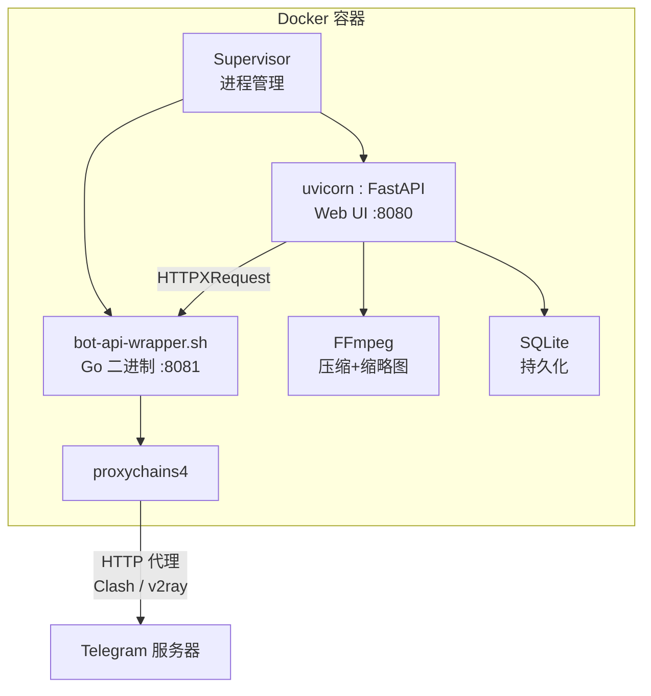

# 🎬 TG视频发布助手

> Telegram 视频自动化发布工具 — 压缩、宫格缩略图、定时发布、统一工作台。

[](LICENSE)
[](https://python.org)
[](https://vuejs.org)

---

## ✨ 特性

| 模块 | 说明 |
|------|------|
| 🎥 **视频工作台** | 目录浏览、多选视频 → 一键跳转压缩/发布/计划页面 |
| ⚡ **压缩任务** | 预设(H.264/H.265/High) + 目标体积 + 可选分辨率 (4K/1080p/720p)，批量配置 |
| 🖼️ **宫格缩略图** | 压缩后自动生成，3×3/2×3/4×4/2×2 可选，支持重新生成，CSS 遮罩预览 |
| 📤 **异步发布** | 排队/暂停/排序/重试，WebSocket 实时步骤日志，缩略图+视频双遮罩 |
| ⏰ **定时计划** | Cron 预设/自定义，顺序/随机/循环策略，队列可视化，频道下拉 |
| 📜 **发布记录** | 按文件名/频道/日期/状态筛选，缩略图预览，失败重试，记录删除 |
| 📢 **通知设置** | 5 类事件独立开关 + 模板 + 多通知对象，30s 频率限制防风暴 |
| 🌐 **代理就绪** | proxychains 透明代理全部 MTProto+DNS+Webhook 流量，Clash HTTP 代理兼容 |
| 🧹 **磁盘管理** | 孤儿压缩输出/缩略图/临时文件扫描 + 分类清理 |
| 🐳 **Docker 单镜像** | `docker compose up` 即用，arm64/amd64 双架构 |

---

## 🏗️ 架构



---

## 🚀 快速开始

### 前置准备

**Telegram Bot** — 找 [@BotFather](https://t.me/BotFather) 创建，获得 Bot Token。
**API ID + Hash** — [my.telegram.org/apps](https://my.telegram.org/apps) 登录后获取。
**代理**（国内必需）— 一个可用的 HTTP 代理，如 Clash 的 `http://192.168.1.100:7890`。

### docker-compose.yml

```yaml
services:
  tg-video-publisher:
    image: ghcr.io/marod1m/tg-video-publisher:latest
    container_name: tg-video-publisher
    restart: unless-stopped
    cap_add:
      - SYS_PTRACE
    ports:
      - "8080:8080"
    volumes:
      - /volume1/videos:/data/videos:ro
      - /volume1/docker/tg-publisher/output:/data/output
      - /volume1/docker/tg-publisher/thumbnails:/data/thumbnails
      - /volume1/docker/tg-publisher/config:/app/config
    environment:
      TZ: Asia/Shanghai
      # 国内 — 取消注释填写 Clash HTTP 代理地址
      # BOT_API_PROXY=http://192.168.1.100:7890
```

启动：

```bash
docker compose up -d
```

### 首次设置

1. 打开 `http://你的IP:8080`
2. 创建管理员账号（用户名 + 密码）
3. 填写 **Bot Token**（从 @BotFather）
4. 填写 **API ID + API Hash**（从 my.telegram.org）
5. 确认目录路径 → 完成设置

> 如果已配置 `BOT_API_PROXY`，Bot 启动后自动通过代理连接 Telegram。否则可在 Web UI 系统设置中配置代理。

---

## 🖥️ 群晖部署

1. File Station 创建共享文件夹：`docker/tg-publisher/{output,thumbnails,config}`
2. Container Manager → 项目 → 新增 → 粘贴上面的 docker-compose.yml
3. 修改 volumes 路径为你的实际路径
4. 国内用户取消注释 `BOT_API_PROXY` 并填写代理地址
5. 启动 → 访问 `http://群晖IP:8080`

---

## 🤖 GitHub Actions 自动构建

推送 `v*` 格式标签自动触发 `linux/amd64` + `linux/arm64` 双架构构建并推送到 `ghcr.io`。

---

## ❓ FAQ

<details>
<summary><b>国内服务器如何配置代理？</b></summary>

在 `docker-compose.yml` 的 environment 中取消注释并填写：

```yaml
BOT_API_PROXY=http://192.168.1.100:7890
```

容器启动后通过 proxychains 将**全部出站流量**（DNS + MTProto + Webhook）透明代理到该地址。Clash 默认 HTTP 端口为 7890。

也可以进入 Web UI → 系统设置 → 代理标签配置。
</details>

<details>
<summary><b>普通 Bot 能上传大文件吗？</b></summary>

不能 — Telegram 标准 Bot API 限制 50 MB。本项目内置 Local Bot API Server，将上传上限提升至 2000 MB (2GB)。
</details>

<details>
<summary><b>支持哪些视频格式？</b></summary>

`mp4` · `mkv` · `avi` · `mov` · `wmv` · `flv` · `webm` · `m4v` · `ts` · `mts` · `m2ts`
</details>

<details>
<summary><b>支持 GPU 加速吗？</b></summary>

启动时自动检测：NVIDIA NVENC → Intel QSV → VAAPI。检测到后优先使用硬件编码器。无 GPU 时回退到 CPU（已为群晖 N100 优化）。
</details>

<details>
<summary><b>忘记密码怎么办？</b></summary>

登录页点击"忘记密码" → 输入用户名 → 系统发送验证码到管理员 Telegram → 输入验证码和新密码。也可用 CLI：

```bash
docker exec -it tg-video-publisher python -m app.cli.main reset-admin --interactive
```
</details>

---

## 🛠️ 开发

```bash
# 后端
python -m venv .venv && source .venv/bin/activate
pip install -r requirements.txt
uvicorn app.main:app --reload

# 前端
cd frontend
pnpm install && pnpm dev
# → http://localhost:5173 (proxy → backend)

# 构建镜像
docker build -t tg-video-publisher .
```

---

## 📄 许可证

MIT License — 详见 [LICENSE](LICENSE) 文件。
